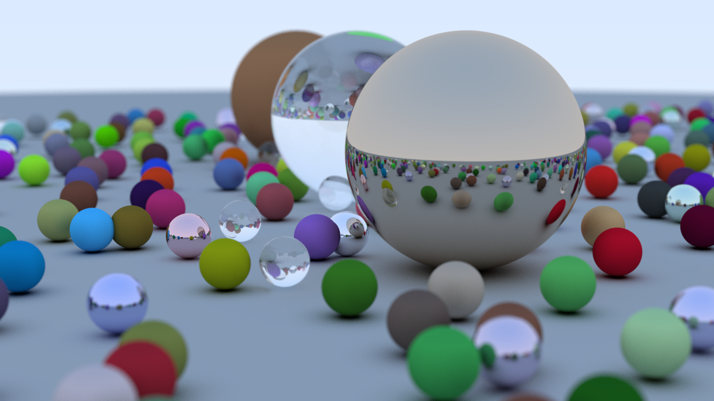
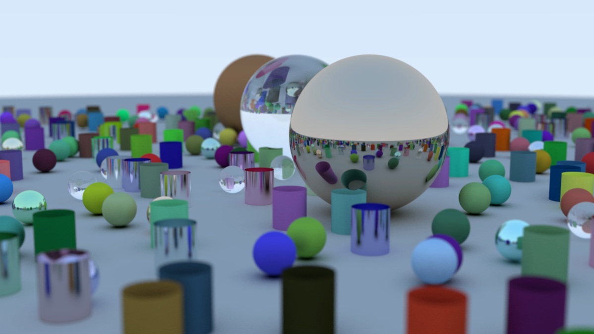

# yet-another-ray-tracing-in-one-weekend
A ray tracer implemented in Rust, following Peter Shirley's "Ray Tracing in One Weekend" tutorial with some custom enhancements and optimizations.

## Features

- **Pure Rust Implementation**: Written entirely in Rust.
- **Enum-Based Architecture**: Uses enums instead of trait objects for geometries and materials, avoiding dynamic dispatch for better performance.
- **Multiple Geometry Types**: 
  - Spheres (from original tutorial)
  - Cylinders (custom addition for enhanced scenes)
- **Multi-threaded Rendering**: Parallel processing support for significantly faster render times

## Performance
All scenes are rendered on an i7-11thGen.
### Benchmark Results

| Configuration | Resolution | Samples | Threads | Render Time |
|---------------|------------|---------|---------|-------------|
| Standard      | 1200×675   | 500     | 1       | ~19 minutes |
| Multi-threaded| 1200×675   | 500     | 6       | ~7 minutes  |
| High-res      | 8K         | 500     | 6       | 9 hours     |

## Sample Renders

### Classic Ray Tracing Scene
*Standard scene following the original tutorial*

### High-Resolution 8K Render
*Same scene rendered at 8K resolution (9-hour render)*

### Custom Cylinder Scene
*Enhanced scene with custom cylinder geometries*

## Future Enhancements

- [ ] Additional primitive types (planes, triangles, meshes)
- [ ] Bounding Volume Hierarchy (BVH) for complex scenes
- [ ] Direct lighting sources
- [ ] Real-time preview mode (eframe&egui)
